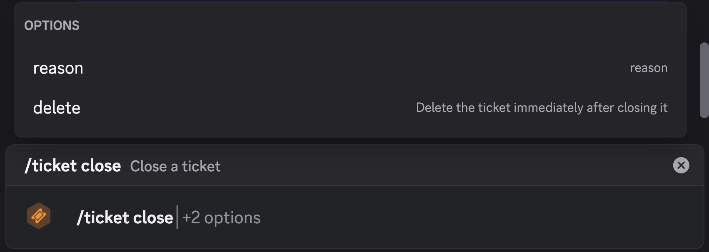
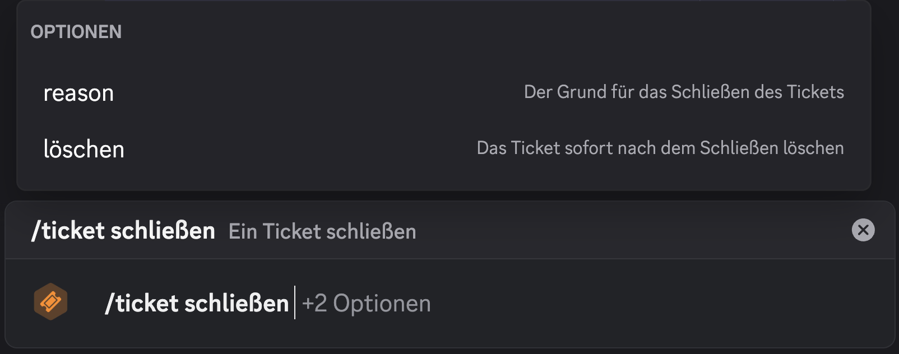
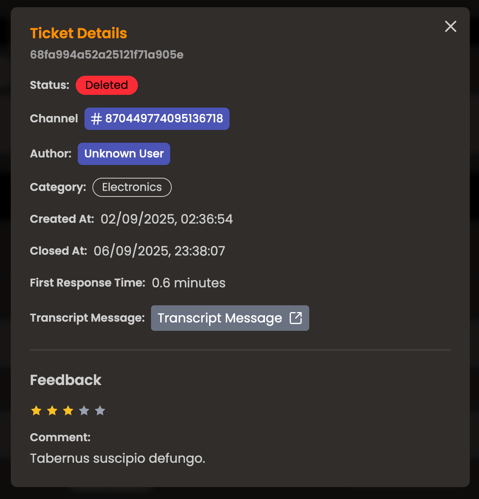

import { Aside } from "@astrojs/starlight/components";
import ImageWrapper from "../../../components/ImageWrapper.astro";

## 30.10.2025

### Localization Update!

The full bot is now localized! All bot messages and interactions are available in English (default) and German.

There is a difference between the client-localization and the server-localization:

- Command localization is determined by the language your Discord client is set to.
- Server-localization is determined by the language set in the dashboard for your server (on the overview page).

You can assume that every **public message** uses **server-scoped localization**, while **interactions** (commands, components) use **client-localization**.

### Bug Fixes

- Fixed an issue where some messages were not being localized correctly.
- Fixed an issue where the bot would not clear the locale cache correctly, causing incorrect messages to be sent for a short period of time after changing the server language.
- Fixed a major issue where the dashboard would not be able to retrieve user mentions. This was due to a Docker misconfiguration that prevented the website from reaching the bot's API.

### Additions

- Added a more detailed close DM message, which includes information about the ticket
- Dashboard Redirects: When not logged in, the route you're trying to access is now saved and you will be redirected there after logging in.
  You can even use `/dash?next=/some/route` to specify a redirect route manually. (This only works for internal routes for security reasons.)

## 28.10.2025

### Localization!

I've added the first localization to the project: Commands!

All commands now have English (default), German and French translations. This is determined by the language you have your Discord client set to.

There is more to come in the future, but this is a good start!

#### Examples

<ImageWrapper>
  
</ImageWrapper>

<ImageWrapper>
  
</ImageWrapper>

## 26.10.2025

### Tickets Page

After much consideration, I have decided to change the feedback page into a tickets page. This page will allow server administrators to view the tickets of their server, along with detailed information about each ticket.

Additionally, if a ticket has feedback, it will be displayed on the ticket details page.

<ImageWrapper>
  
</ImageWrapper>

## 24.10.2025

### Feedback Page

- Added a comprehensive feedback management page in the dashboard that allows server administrators to view and analyze user feedback about their support ticket experience.
  - The backend uses MongoDB aggregation to join feedback documents with their corresponding tickets, allowing filtering by category while maintaining performance. Date range filters support ISO timestamps, and rating filters accept comma-separated values for multi-select functionality.

<Aside type="caution" title="Important">
  It is very likely that this page will be turned into a tickets page in the
  future, so you can not only view feedback in the dashboard, but also detailed
  information about tickets themselves. Not sure how this will look yet.
</Aside>

## 21.10.2025

- Added the functionality to DM the user who added the bot to a server.
  - This works with discord's webhook events feature, where I would get notified when the bot is added to a server, and then I can send a DM to the user who added it.

## 20.10.2025

- Fixed a bug where the ticket channel would be publicly visible to all users.
  - The underlying issue was that the permission overwrites for the ticket channel would set the `VIEW_CHANNEL` permission to `false` but the overwrite type was set to `member` instead of `role`, causing the permission to not apply correctly.
