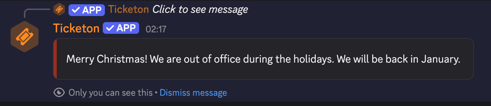

import { Aside, Icon } from "@astrojs/starlight/components";
import ImageWrapper from "../../../components/ImageWrapper.astro";
import LinkButton from "../../../components/LinkButton.astro";

## 28.12.2025

### Out of Office Notice

You can now set an out of office notice for your server!  
When enabled, users will see this notice when they try to create a ticket, and ticket creation will be blocked until the notice is removed again.

<ImageWrapper>
  
</ImageWrapper>

  <LinkButton href="/dashboard/overview#out-of-office-notice" variant="secondary">
    Dashboard Docs
  </LinkButton>

  <LinkButton href="/commands/overview#out-of-office-notice" variant="secondary">
    Command Docs
  </LinkButton>

## 19.12.2025

### New Dashboard Features

You can now configure the allowed mentions for messages, which allows you to control who gets mentioned when the bot sends the message.

<ImageWrapper>
  
</ImageWrapper>

By default, all mentions are disabled to prevent unwanted pings. Previously, messages sent from the dashboard would also do this,
but messages sent with commands would still mention everyone (not \@everyone!) by default.

<LinkButton
  href="/dashboard/messages#allowed-mentions-settings"
  variant="secondary"
>
  Read More
</LinkButton>

### Dashboard Changes

- The Premium Overview page should now function correctly, instantly showing the correct premium status without needing to refresh the page.

## 18.12.2025

### Dashboard Update

Minor improvements to the dashboard UI:

- the channel naming template is now available (this was forgotten before)  
  This also has a small info modal where you can also copy usable variables.

<ImageWrapper>
  
</ImageWrapper>

<ImageWrapper>
  
</ImageWrapper>

### New Commands

- `/ticket rename` - Rename the ticket channel to a new name.
- `/who-claimed` - View who is currently handling the ticket.

## 17.12.2025

### Dashboard Update

- Minor Bug fixes with the forms editor.
- Next billing date for paddle subscriptions is now displayed in the premium overview.
- https://ticketon.app/trello now redirects to the new public trello board at https://trello.com/b/8mpb6ROW/ticketon

## 16.12.2025

### Ticket Transfer Changes

Previously, you could only transfer a ticket to another category by using the select menu from the ticket controls.  
Now, you can also use the `/transfer ticket` command (this was forgotten before, although it was implemented).

There are also a number of changes to how ticket transfers work:

- When transferring a ticket and the new category has a form, and you want the user to fill out the form before transferring,
  the bot will not directly transfer the ticket, but instead will send a message to the ticket channel with a button that the user can click to fill out the form.
- By default, the user will **not** be asked to fill out the form (when there is one).

[Read More About Ticket Transfers](/guides/ticket-transfers)

## 11.12.2025

**Fix Tickets Command!**

You can now use the `/fix-tickets` command to fix inconsistencies with tickets in the database!

Read more about it on the [Fix Tickets Command page](/commands/fix-tickets).

### More New Stuff

- The default starter message now also displays form results, if any are present.

### Fix

The edge case that manually deleted ticket channels would not update the ticket status in the database has been fixed. A handler was added to listen for channel deletions and update the ticket status accordingly.
If the bot is offline when the channel is deleted, you can use the new `/fix-tickets` command to fix the inconsistencies.

## 14.11.2025

**Forms File Upload Component!**

You can now add a File Upload component to your forms in the dashboard!  
This component allows users to upload files when submitting forms, with support for multiple files per field (up to a configurable maximum). Uploaded files are stored in a dedicated thread on the ticket's starter message for easy access and context.

### Key Features:

- **Limitations**: File size is capped by the server's upload limit or the user's Nitro limit (whichever is lower). Supported types are determined by Discord.
- **Message Label**: Customize the label for the upload message in the thread. If not set, it defaults to the field label.
- **Handling Oversized Files**: Files exceeding the message size limit are grouped or linked to ensure they fit, maintaining clear context.

For more details, check out the [Forms documentation](/dashboard/forms).

**Transcript Message Enhancements**

The transcript message has been improved to include more detailed information about the form submission - including all form uploads!  
This is because uploaded files are not preserved in the transcript.

## 05.11.2025

**Message sharing/importing!**

You can now share custom messages in the dashboard with others and also import shared messages from others!

### Sharing Messages

You can click the blue <Icon name="setting" size="1.1.rem" class="inline-block text-blue-500" /> icon next to the message name in the message editor to open settings modal.

<ImageWrapper>
  
</ImageWrapper>

There you can toggle sharing on or off and also enable password protection for your shared message.
If you enable password protection, a password gets generated that other users need to enter when importing your message.
When sharing is enabled, a unique URL is generated that you can share with others.

### Importing Shared Messages

To import a shared message, go to the Custom Messages page in the dashboard and click the green <Icon name="download" size="1.1.rem" class="inline-block text-green-500" />
button next to the "Create New Message" button to open the import modal.

There you need to paste the shared message URL and, if applicable, enter the password.

<ImageWrapper>
  
</ImageWrapper>

_Note, that the password input only shows up if the shared message is password protected._

### Message Preview

When sharing is enabled for a message, the generated URL can be used to preview the message in read-only mode.
However, the preview does not display the layout of how it will look in Discord because it would take **very**
long to implement a full Discord message renderer. Maybe some time in the future...

<ImageWrapper>
  
</ImageWrapper>

## 04.11.2025

**Blacklist!**

It is now possible to blacklist users from creating tickets in your server!

This can be done using the new `/blacklist` command, which allows moderators to add, remove and check if a user is blacklisted.

Viewing the blacklist is not possible via a command, but soon it will be in the dashboard.

## 03.11.2025

Custom Messages Onboarding!

I've noticed that many people don't understand how Components V2 work and how to work with it. To help with that, I've added a simple onboarding flow when you visit the Custom Messages page for the first time (per device).

It consists of four steps that explain the basics of Components V2 and how to use them.

## 02.11.2025

Big Fixes!

Today I fixed some major issues:

1. Forms with descriptions might not have been working.

   - This was due to Discord not accepting empty strings as valid description values but wanting `undefined` instead.

2. Closing your own ticket did not work, even though you were a manager.

   - This was due to a logic error in the permission checking code. It checked if you were the ticket owner first, and if you were, it would not check for manager permissions.  
     Now it checks for manager permissions first, and if you are a manager, you can close your own ticket.

## 30.10.2025

### Localization Update!

The full bot is now localized! All bot messages and interactions are available in English (default) and German.

There is a difference between the client-localization and the server-localization:

- Command localization is determined by the language your Discord client is set to.
- Server-localization is determined by the language set in the dashboard for your server (on the overview page).

You can assume that every **public message** uses **server-scoped localization**, while **interactions** (commands, components) use **client-localization**.

### Bug Fixes

- Fixed an issue where some messages were not being localized correctly.
- Fixed an issue where the bot would not clear the locale cache correctly, causing incorrect messages to be sent for a short period of time after changing the server language.
- Fixed a major issue where the dashboard would not be able to retrieve user mentions. This was due to a Docker misconfiguration that prevented the website from reaching the bot's API.

### Additions

- Added a more detailed close DM message, which includes information about the ticket
- Dashboard Redirects: When not logged in, the route you're trying to access is now saved and you will be redirected there after logging in.
  You can even use `/dash?next=/some/route` to specify a redirect route manually. (This only works for internal routes for security reasons.)

## 28.10.2025

### Localization!

I've added the first localization to the project: Commands!

All commands now have English (default), German and French translations. This is determined by the language you have your Discord client set to.

There is more to come in the future, but this is a good start!

#### Examples

<ImageWrapper>
  
</ImageWrapper>

<ImageWrapper>
  
</ImageWrapper>

## 26.10.2025

### Tickets Page

After much consideration, I have decided to change the feedback page into a tickets page. This page will allow server administrators to view the tickets of their server, along with detailed information about each ticket.

Additionally, if a ticket has feedback, it will be displayed on the ticket details page.

<ImageWrapper>
  
</ImageWrapper>

## 24.10.2025

### Feedback Page

- Added a comprehensive feedback management page in the dashboard that allows server administrators to view and analyze user feedback about their support ticket experience.
  - The backend uses MongoDB aggregation to join feedback documents with their corresponding tickets, allowing filtering by category while maintaining performance. Date range filters support ISO timestamps, and rating filters accept comma-separated values for multi-select functionality.

<Aside type="caution" title="Important">
  It is very likely that this page will be turned into a tickets page in the
  future, so you can not only view feedback in the dashboard, but also detailed
  information about tickets themselves. Not sure how this will look yet.
</Aside>

## 21.10.2025

- Added the functionality to DM the user who added the bot to a server.
  - This works with discord's webhook events feature, where I would get notified when the bot is added to a server, and then I can send a DM to the user who added it.

## 20.10.2025

- Fixed a bug where the ticket channel would be publicly visible to all users.
  - The underlying issue was that the permission overwrites for the ticket channel would set the `VIEW_CHANNEL` permission to `false` but the overwrite type was set to `member` instead of `role`, causing the permission to not apply correctly.
