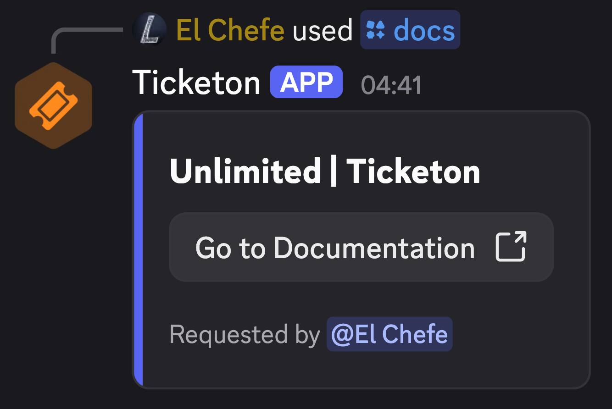

The `/docs` command allows users to search documentation directly from the Discord bot using Algolia integration (search engine).

This feature is particularly useful when not wanting to pull up the docs and searching through them manually.

## The Response

After selecting a result, the bot will provide a link to the relevant documentation page/section.

The response is hidden by default, but if setting the `hidden` option to `false`, the response will be visible to everyone in the channel and the command author will be cited.

import CenterH from "../../../components/CenterH.astro";

<CenterH>
  
</CenterH>
