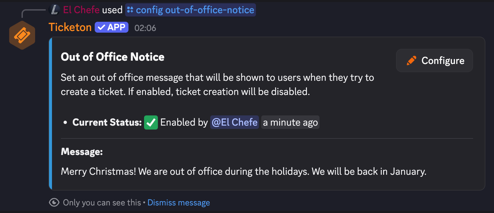

import { LinkCard } from "@astrojs/starlight/components";
import ImageWrapper from "../../../components/ImageWrapper.astro";

This page provides an overview of all available commands for Ticketon.

| Command            | Description                                      | Documentation                                                                                             | Default Permissions |
| ------------------ | ------------------------------------------------ | --------------------------------------------------------------------------------------------------------- | ------------------- |
| `/help`            | Get help with commands                           | [Help Command](/commands/help)                                                                            | -                   |
| `/create-ticket`   | Create a new ticket                              | [Create Ticket Command](/commands/create-ticket)                                                          | -                   |
| `/premium`         | Get the premium status of the current server     | [Premium Command](/commands/premium)                                                                      | -                   |
| `/docs`            | Search the documentation                         | [Docs Command](/commands/docs)                                                                            | -                   |
| `/who-claimed`     | View who is currently handling the ticket        | -                                                                                                         | -                   |
| `/message`         | Send a custom message into a channel             | [Message Command](/commands/message)                                                                      | Manage Messages     |
| `/ticket`          | Manage support tickets                           | [Ticket Command](/commands/ticket)                                                                        | Moderate Members    |
| `/open-ticket-for` | Open a ticket for another user                   | [Open Ticket For Command](/commands/open-ticket-for)                                                      | Moderate Members    |
| `/blacklist`       | Manage the server blacklist                      | [Blacklist Command](/commands/blacklist)                                                                  | Moderate Members    |
| `/fix-tickets`     | Fix inconsistencies with tickets in the database | [Fix Tickets](/commands/fix-tickets)                                                                      | Manage Server       |
| `/setup`           | Get a link to the setup guide                    | [Out of Office Notice](#out-of-office-notice) and [Setup Guide](/getting-started#getting-started-finally) | Manage Server       |
| `/config`          | Configure bot settings                           | -                                                                                                         | Manage Server       |

## Ping Command

There is no dedicated ping command. Instead, you can check the bot's latency by mentioning it in any channel with `@Ticketon ping` (only in servers). The bot will respond with its status information and some links.

| Response Field    | Description                                                                               |
| ----------------- | ----------------------------------------------------------------------------------------- |
| API Ping          | Latency between the bot and Discord's API; Updates every few minutes                      |
| Roundtrip Latency | Time taken for the bot to respond (Bot > Discord > Bot); Calculated in real-time          |
| Uptime            | Duration the bot has been online since the last restart; Restarts happen to apply updates |
| Guilds            | Number of servers the bot is currently in                                                 |

#### Cooldown Period

To prevent spam, this feature has a cooldown of 1 minute per server. The bot will then just react with a ⏳ emoji if you mention it during a cooldown period.

<ImageWrapper>
  
</ImageWrapper>

## Specific Config Commands

Not all config commands will be covered here, only the ones that are not self-explanatory or have additional information.

### Set Language

`/config set-language <language>`

The set language command allows you to change the bot's language for your server. By default, Ticketon uses the server's preferred language as set in Discord if it is supported, otherwise it defaults to English.
You can use this command to set a specific language for the bot in your server, overriding the default behavior.

### Out of Office Notice

`/config out-of-office-notice`

The out of office notice is a message shown to users when they create a ticket while you're marked as out of office.
If enabled, users will see this notice when they open a ticket and ticket creation will be blocked until the notice is removed again. To enable this, you can either go to the [Server Dashboard](https://ticketon.app/dash?next=/overview) or use the `/config out-of-office-notice` command.

<ImageWrapper>
  
</ImageWrapper>

### Debug

`/debug <ticket-category>`

The debug command checks if the bot has all required permissions for a ticket category. It will list any missing permissions that could prevent the bot from functioning correctly in that category.

## Additional Resources

For more detailed information on each command, please refer to the respective documentation pages linked in the table above.

If you need further assistance, feel free to join our [Discord Support Server](https://ticketon.app/discord) or visit our [Website](https://ticketon.app).

<LinkCard
  title="Discord Support Server"
  description="Join our Discord server for support and community discussions."
  href="https://ticketon.app/discord"
  icon="discord"
  target="_blank"
/>
