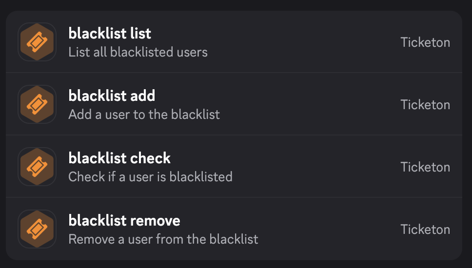

import LinkButton from "../../../components/LinkButton.astro";
import ImageWrapper from "../../../components/ImageWrapper.astro";

<LinkButton
  href="https://ticketon.app/dash?next=/blacklist"
  target="_blank"
  icon="external"
>
  Manage Blacklist
</LinkButton>

The blacklist allows you to prevent specific users from creating support tickets in your server.
When a user is blacklisted, they can still interact with existing tickets they have access to, but they won't be able to create new ones.

Mods can also still use `/open-ticket-for` to open tickets for blacklisted users, but the users themselves can't.

## Manage the blacklist

The dashboard page is just for viewing the blacklist, since there is no need for managing the blacklist in the dashboard (convince me otherwise if you think there is a valid reason).

To manage the blacklist, you can use the following commands:

<ImageWrapper size="lg">
  
</ImageWrapper>

_Techincally, the `list` command is just responding with a link to the dashboard - this is done for consistency and to avoid annoying questions in the support server._

The commands should be self-explanatory; if you have questions, please join the [support server](https://ticketon.app/support).
