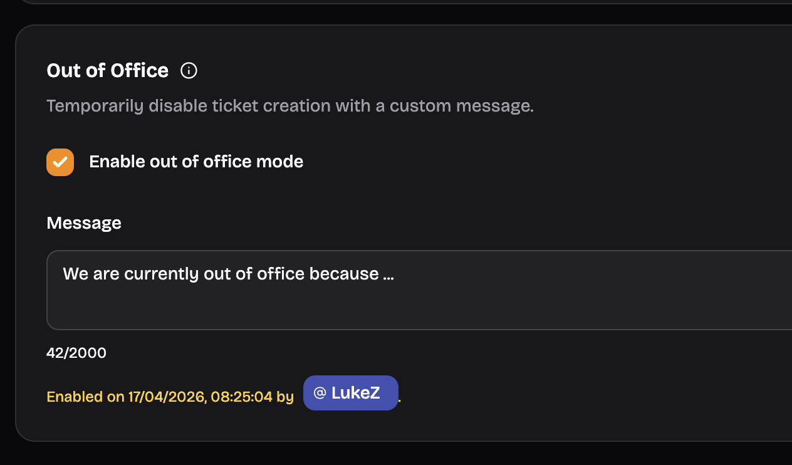

import { LinkCard, Aside } from "@astrojs/starlight/components";
import Feature from "../../../components/Feature.astro";

The Dashboard provides a user-friendly interface to manage and configure various aspects of the application.

## Dashboard Structure

The dashboard is divided into several key sections:

### User-Specific

<LinkCard
  href="https://ticketon.app/dash/billing"
  target="_blank"
  title="Billing"
  description="Manage your billing information and subscriptions."
/>

### Server Management

<Aside type="note">
  You must at least have the `Manage Server` permission in a server to access
  its dashboard page.  
  Advanced permission configuration is planned for a future update.
</Aside>

<Feature header="Premium Management" href="/dashboard/premium">
  Manage a server's premium subscription.
</Feature>

<Feature header="Category Configuration" href="/dashboard/categories">
  Configure the ticket categories.
</Feature>

<Feature header="Form Management" href="/dashboard/forms">
  Create and manage forms for user input.
</Feature>

<Feature header="Custom Messages" href="/dashboard/messages">
  Make beautiful customized messages.
</Feature>

<Feature header="Support Schedule" href="/dashboard/schedule">
  Configure a support schedule.
</Feature>

<Feature header="Analytics" href="/dashboard/analytics">
  View analytics of feedback and tickets.
</Feature>

<Feature header="Audit Log" href="/dashboard/audit-log">
  View the history of actions taken.
</Feature>

<Feature
  header="Transcripts"
  href="/dashboard/transcripts"
  cta="Use Transcripts"
>
  Understand how transcripts work.
</Feature>

## Global Server Settings

There are also some global settings that affect your whole server.

| Setting              | Description                                                                                                | Options       | Default  |
| -------------------- | ---------------------------------------------------------------------------------------------------------- | ------------- | -------- |
| Language             | The language used for public bot messages in your server.                                                  | en, de        | en       |
| Manager Roles        | Roles that can manage tickets, they did not claim                                                          | Server roles  | None     |
| Allow Manager Bypass | Whether users with a manager role are allowed to manage tickets, bypassing restrictions like claim status. | Yes/No        | No       |
| Out of Office Notice | A notice shown to users when they create a ticket while you're out of office.                              | Status & Text | Disabled |

### Localization

There are two types of localization in the bot:

- **Client-localization**: This is determined by the language your Discord client is set to. It affects interactions like commands and components.
- **Server-localization**: This is determined by the language set in the dashboard for your server (on the overview page). It affects public messages sent by the bot (excluding custom messages).

### Manager Roles

Manager roles are special roles that can manage tickets without needing to claim them first (if **Allow Manager Bypass** is enabled). This applies to users who have at least one of those roles.
This is useful for large support hirarchies where higher level staff need to oversee tickets without being directly involved.

Those users will also be able to respond to their own close requests. This is important for when you're testing something and create a close request in your own ticket.

### Allow Manager Bypass

When this setting is enabled, users with a manager role can manage tickets without being affected by restrictions like claim status. For example, if a ticket is set to "claimed only", a manager can still manage it even if they haven't claimed it.

### Out of Office Notice

The out of office notice is a message shown to users when they create a ticket while you're marked as out of office.
If enabled, users will see this notice when they open a ticket and ticket creation will be blocked until the notice it is removed again.

<ImageWrapper>
  
</ImageWrapper>
