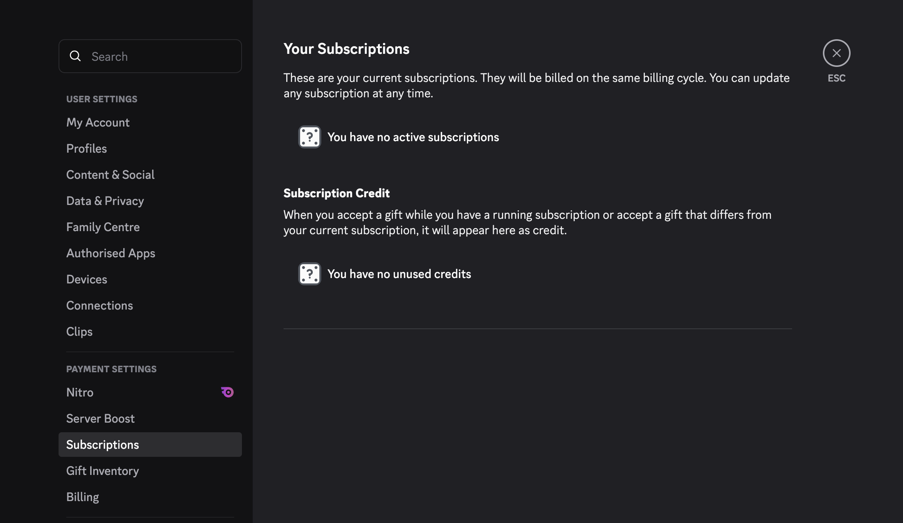

import { Tabs, TabItem } from "@astrojs/starlight/components";
import ImageWrapper from "../../../components/ImageWrapper.astro";
import ManageOnDesktopImg from "../../../assets/docs/how-to-manage-in-app-subs.png";

There are two ways to manage a subscription. However, first we need to clarify that subscriptions made through Discord barely support the project.
It is recommended to use the dashboard directly to get [Unlimited](/unlimited) and support the project more effectively, since Discord takes a huge cut of the revenue.

## How do I manage my subscription through Discord?

<Tabs syncKey="platform">
  <TabItem label="Desktop" icon="laptop">
    1. Open Discord and go to your **User Settings** by clicking on the gear
    icon located at the bottom left corner of the Discord window.

    2. In the left sidebar, scroll down and click on **Subscriptions** under the
    **Payment Settings** section.

    3. Here, you will see a list of your active subscriptions. Find the Ticketon
    subscription and click on it to view more details.

    <ImageWrapper size="lg">
      
    </ImageWrapper>

  </TabItem>
  <TabItem label="Mobile" icon="phone"></TabItem>
</Tabs>
