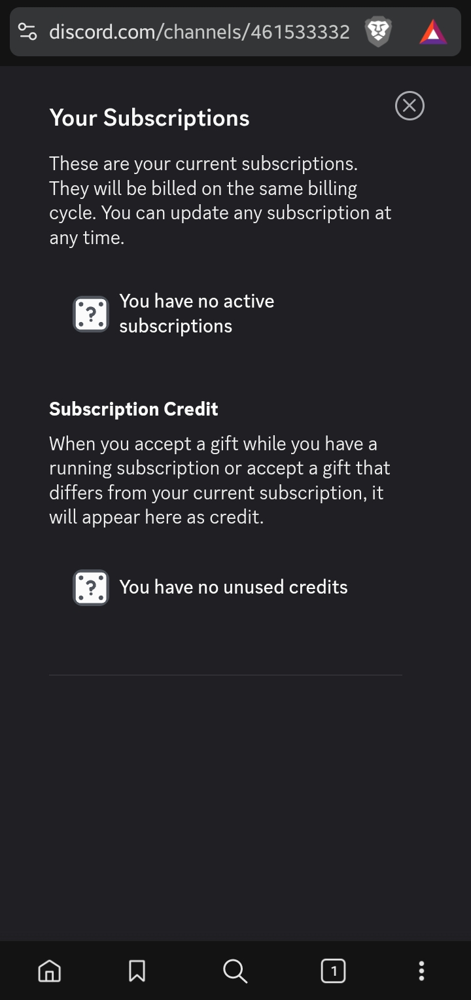

import { Tabs, TabItem, Steps, Aside } from "@astrojs/starlight/components";
import ImageWrapper from "../../../components/ImageWrapper.astro";
import Link from "../../../components/Link.astro";

<Aside type="caution" icon="information">
  Before we jump into the topic, we need to clarify that subscriptions made
  through Discord barely support the project. It is recommended to use the
  dashboard directly to get [Unlimited](/unlimited) and support the project more
  effectively, since Discord takes a huge cut of the revenue.
</Aside>

## How do I manage my subscription through Discord?

<Tabs syncKey="platform">
  <TabItem label="Desktop" icon="laptop">

    <Steps>
    1. Open Discord and go to your **User Settings** by clicking on the gear
    icon located at the bottom left corner of the Discord window.

    2. In the left sidebar, scroll down and click on **Subscriptions** under the
    **Payment Settings** section.

    3. Here, you will see a list of your active subscriptions. Find the Ticketon
    subscription and click on it to view more details.
    </Steps>

    <ImageWrapper size="lg">
      
    </ImageWrapper>

  </TabItem>
  <TabItem label="Mobile" icon="phone">
    You can't manage subscriptions through the Discord mobile app. It appears that Discord did not expect people to be using mobile devices.

    To manage your subscription, you will need to use a web browser on your phone:

    <Steps>
    1. Open your mobile web browser, go to the <Link href="https://discord.com/channels/@me">Discord website</Link> and log in, if you haven't already.

    2. Go to your **User Settings** by clicking on the gear
    icon located at the bottom right corner of the Discord window.

    3. In the left sidebar, scroll down and click on **Subscriptions** under the
    **Payment Settings** section.

    4. Here, you will see a list of your active subscriptions. Find the Ticketon
    subscription and click on it to view more details.
    </Steps>

    <ImageWrapper size="sm">
      
    </ImageWrapper>

  </TabItem>
</Tabs>
