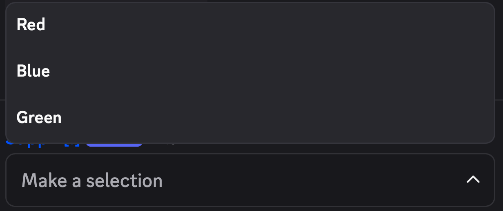

import ImageWrapper from "../../../components/ImageWrapper.astro";

## What is a "String Select Menu"?

### What is a String?

A string is simply a piece of text, like a word, sentence, or any sequence of letters, numbers, and symbols.
For example, "Hello World" or "123 Main Street" are strings.  
In everyday terms, think of it as the content you type into a text box or see on a screen—it's just data stored as text.

### What is a String Select Menu?

A string select menu is a dropdown list in a form where you can choose one option from a set of predefined text choices (strings).  
It's like picking from a menu in a restaurant app: instead of typing everything yourself, you click to select something
like "Small", "Medium", or "Large" from a list. This makes forms easier and faster to fill out by limiting choices to valid text options.

A string select menu option has a label and a value.

- The **label** is what gets displayed in the dropdown list for users to see and select.
- The **value** is the actual data that will get sent to the server when the form is submitted.

## Using String Select Menus in Forms

String select menus can be added to forms in the same way as other components, like text inputs.

With Ticketon, string select menu option values serve a different purpose. The value(s) is/are later displayed after the form is submitted.

For example, if you have a form asking users to select their favorite color, you might set up the string select menu like this:

| Label | Value |
| ----- | ----- |
| Red   | 🔴    |
| Blue  | 🔵    |
| Green | 🟢    |

If you use the variable for the form component in the starter message, the output may look like this:

> **Favorite Color:** 🔵

While the select menu looks like:

<ImageWrapper size="lg" class="ml-0">
  
</ImageWrapper>

This way, users can easily select their favorite color from the dropdown, and when they submit the form, the corresponding value (like the blue circle emoji) is displayed in the message.

## Multiple Selection

When creating a string select menu, you can allow users to select multiple options by setting the max and min values accordingly.

The output will then display all selected values, separated by commas.

Example:

> **Favorite Colors:** 🔴, 🟢
